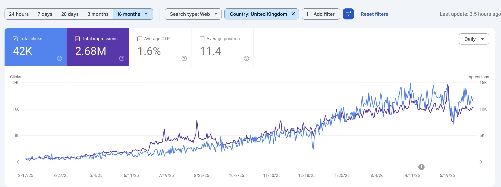

# SEO Manager

Helping businesses grow organic traffic through SEO strategies, keyword research, and technical optimization.

---

## 🚀 Data-Driven Organic Growth Strategist

I am an SEO specialist with **10+ years of experience** helping businesses improve organic traffic, keyword rankings, and lead generation through **technical SEO, on-page optimization, and content strategy**.

I have worked on SEO projects across e-commerce, service-based businesses, and digital platforms**, focusing on measurable growth using data-driven SEO strategies.

---

### 📍 Experience
**10+ Years in SEO & Digital Marketing**

### 📊 Core Expertise
- Technical SEO Audits  
- On-Page SEO Optimization  
- Keyword Research (Transactional + Informational)  
- Content Strategy & Optimization  
- SEO Performance Tracking (GSC, GA4)

---

## 🔥 Case Study: Wheel Guys (Automotive SEO)

SEO growth project focused on improving local search visibility, organic traffic, and keyword rankings for an automotive service business.

---

## 🎯 Business Objective

- Increase organic visibility in local search results  
- Improve rankings for high-intent automotive service keywords  
- Drive more organic traffic and service inquiries  
- Strengthen overall website SEO performance  

---

## ❗ Initial Challenges

- New website with no established domain authority  
- No keyword rankings for core service pages  
- Poor visibility in Google Search results  
- Weak on-page SEO structure (titles, headings, metadata)  
- No optimized local SEO targeting  

---

## 🔍 SEO Audit & Analysis

- Identified missing keyword targeting opportunities  
- Found weak internal linking structure  
- Detected missing metadata optimization across pages  
- No structured local SEO signals implemented  
- Pages not properly indexed in search engines  

---

## ⚙️ Strategy & Execution

- Conducted keyword research for automotive services and local intent queries  
- Optimized page titles, meta descriptions, and H1-H3 structure  
- Improved internal linking between service pages  
- Fixed technical SEO issues via Google Search Console  
- Implemented local SEO targeting for “near me” searches  
- Improved content structure for better indexing and relevance  

---

## 🧰 Tools Used

- Google Search Console  
- Google Analytics  
- Keyword research tools (Ahrefs / SEMrush equivalents)  
- Manual SERP analysis  
- Screaming Frog (technical audit support)  

---

## 📈 Results Achieved

- 📈 42,000+ organic clicks generated  
- 👀 2.68M+ impressions in Google Search  
- 📍 Average position improved to 11.4  
- 🔍 Significant improvement in keyword visibility  
- 📊 Steady upward growth in organic performance  

---

## 📸 Proof (Google Search Console)

This data shows real SEO performance improvements achieved through keyword optimization, technical fixes, and improved indexing.

---

## 📈 SEO Focus
- Organic Traffic Growth  
- Keyword Ranking Improvements  
- Conversion-focused SEO Strategy  
- Website Health & Technical Fixes  

---

## 📬 Contact

- 📧 Email: abeerahrana@gmail.com  
- 🔗 LinkedIn: ## https://www.linkedin.com/in/abeerah/
